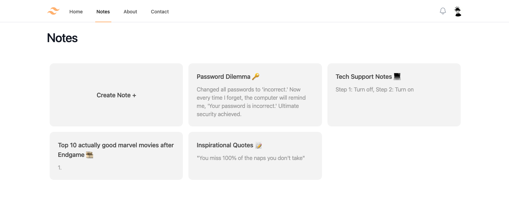

# 📋 Notes App

## About

This project is a humble PHP CRUD (Create, Read, Update, Delete) application that lets you manage your notes with ease. Built on the foundations of my quest to master PHP, this project emerged as a result of traversing the Laracasts - PHP for Beginners series.

## What can this app do?

- Create: Summon new notes into existence.
- Show: Delve into the wisdom stored within your notes.
- Update: Modify and refine your notes as your journey unfolds.
- Delete: Banish obsolete notes from this world.

## Purpose behind this project

This project serves as my PHP training ground, a place where I honed my skills by translating the teachings of Laracasts into practical magic. This notes app embodies the basic essence of PHP, making it the perfect companion for PHP beginners on their learning quest.